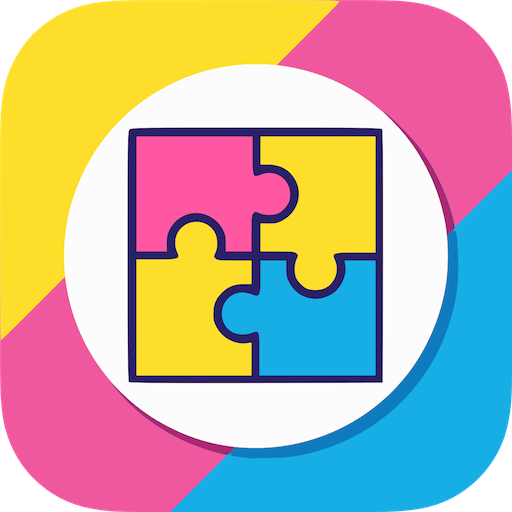

<div align="center">
   
</div>

<div align="center">
    
    
    
    
</div>

<div align="center">
    <h2>Jigsaw</h2>
    <h3>collaborate with empathy</h3>
</div>

[Jigsaw](https://gitlab.oit.duke.edu/MobileCenter/jigsaw) helps reduce bias and miscommunication among people with different political stances.

Originally prototyped by Grant Larson, Mengqian Liu, Shaopeng Zhang and Diego Chamorro, the app was later on continued by Xinyi Hong and Xiaochen Zhou at *Duke's Center for Mobile Development*. Based on previous efforts, Ting(@yo1995) refactored the app and made it public on GitHub. 

The app is sponsored by Department of Philosophy at Duke.

Currently the app is under beta testing.

## Features

Jigsaw features

* [x] Games
* [x] Achievements
* [x] Full Dark Mode support
* [x] ...and many more to be discovered in the app

## Design

*Placeholder*

### Onboarding

*Placeholder*

### Games Lobby

*Placeholder*

### Profile & Game Records

*Placeholder*

### Achievements

*Placeholder*

## Progress notes

*Placeholder*

## Contributing

Contributions are welcome 🙌.

Fixing any [issues](https://github.com/DukeMobileDevCenter/Jigsaw/issues) in the list can be a good start!

## Requirements

* [Xcode 11.0 (or newer)](https://apps.apple.com/us/app/xcode/id497799835)
* [SwiftLint](https://github.com/realm/SwiftLint)
* [ResearchKit](https://github.com/ResearchKit/ResearchKit) from Apple
    * Official Website: https://www.researchandcare.org/researchkit/
* CocoaPods dependencies

### Building with CocoaPods

Please refer to [issue #39](https://github.com/DukeMobileDevCenter/Jigsaw/issues/39) for more details.

1. Clone or download the repository
2. Run the `pod install` command in the `Jigsaw-app` folder
3. Open the `Jigsaw.xcworkspace` workspace file
4. Build with `Jigsaw` scheme

## License

```
Jigsaw
Copyright © Center for Mobile Development 2020
All rights reserved. 
```

last revision: 200905
