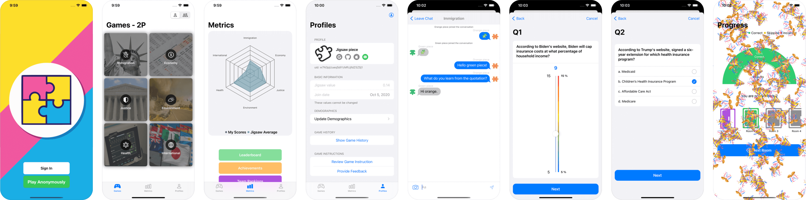

<div align="center">
    
</div>

<div align="center">
    
    
    
    
</div>

<div align="center">
    <h1>Jigsaw<br><i><sup>depolarization by collaboration</sup></i></h1>
</div>

[Jigsaw](https://gitlab.oit.duke.edu/MobileCenter/jigsaw) helps reduce bias and miscommunication among people with different political stances. Collaborate with empathy; Achieve depolarization by collaboration.

The app is sponsored by [Department of Philosophy at Duke](https://kenan.ethics.duke.edu/mad-lab/).

Currently the app is ready for the first release.

## Features

Jigsaw features

* [x] Games: a wide range of topics that cover the most trending public issues in the US
    * Players will collaborate to pass a series of "escape rooms" to better understand various topics from different political stances.
* [x] Achievements and Rankings
* [x] Profiles
* [x] Full Dark Mode support
* [x] ...and many more to be discovered in the app

## Design



The app design includes 3 major functionalities: Games, Stats and Profiles.

### Onboarding

*Placeholder*

### Games Lobby

*Placeholder*

### Achievements & Rankings

*Placeholder*

### Profiles & Game Records

*Placeholder*

## History & Progress Notes

The project refactors the original [Jigsaw course project](https://gitlab.oit.duke.edu/MobileCenter/jigsaw).

Originally prototyped by Grant Larson, Mengqian Liu, Shaopeng Zhang and Diego Chamorro, the app was later on continued by Xinyi Hong and Xiaochen Zhou at *Duke's Center for Mobile Development*. 

Based on previous efforts, Ting(@yo1995) refactored the app and made it public on GitHub.

### Version History

Please refer to [version history](docs/Progress-notes/version-history.md) for more details.

## Contributing

Contributions are welcome 🙌.

Fixing any [issues](https://github.com/DukeMobileDevCenter/Jigsaw/issues) in the list can be a good start!

Please refer to [CONTRIBUTING](docs/CONTRIBUTING.md) for more details.

## Requirements

* [Xcode 12.1 (or newer)](https://apps.apple.com/us/app/xcode/id497799835)
* [SwiftLint](https://github.com/realm/SwiftLint)
* [ResearchKit](https://github.com/ResearchKit/ResearchKit) from Apple
    * Official Website: https://www.researchandcare.org/researchkit/
* CocoaPods dependencies

### Building with CocoaPods

1. Clone or download the repository
2. Run the `pod install` command in the `Jigsaw-app` folder
3. Open the `Jigsaw.xcworkspace` workspace file
4. Build with `Jigsaw` scheme

Please refer to [build setup](docs/build-setup.md) for more details.

### Upload to TestFlight

Please refer to [TestFlight setup](docs/TestFlight-setup.md) for more details.

## License

```
Jigsaw
Copyright © Center for Mobile Development 2020
All rights reserved. 
```

last revision: 201026
